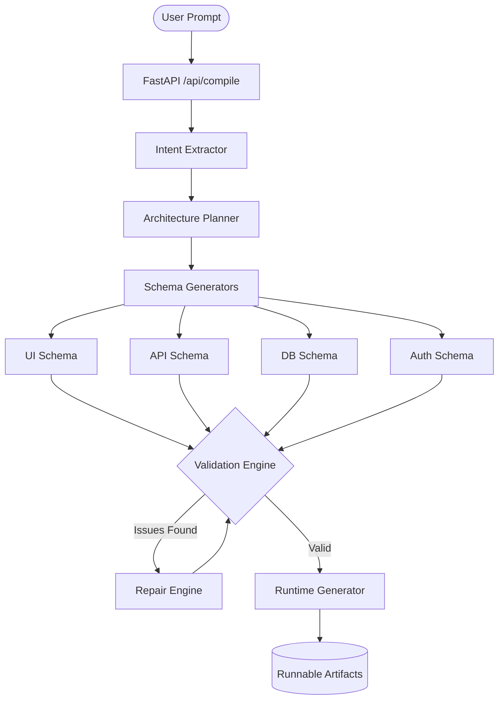
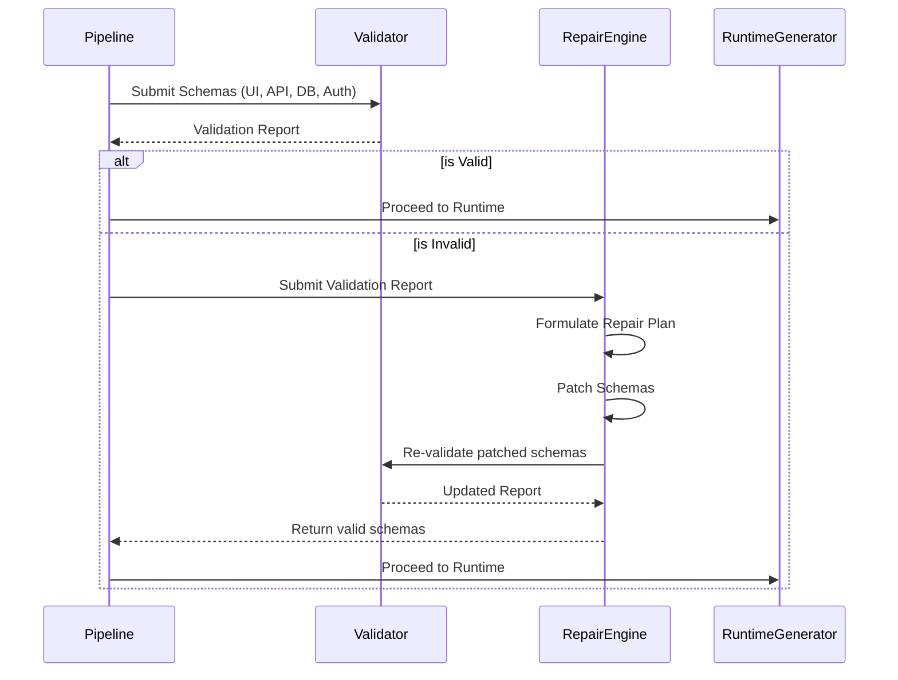

# AI Application Compiler 

## 1. Overview
The **AI Application Compiler** is a production-grade, deterministic pipeline designed to translate natural language application requirements into a validated, repairable, executable application specification and a runnable software scaffold. By treating application generation as a strict compilation process rather than an open-ended generative task, the system guarantees structural integrity, type safety, and operational predictability across the generated frontend, backend, and database layers.

## 2. Problem Statement
Modern LLM-based code generators frequently produce inconsistent, non-deterministic, or structurally flawed applications. Because these systems lack rigorous intermediate representation (IR) tracking, a single hallucination in a database schema or API endpoint often requires completely regenerating the application—introducing new bugs in the process. 

This project solves the reliability crisis in AI code generation by enforcing a strict compiler pipeline. By utilizing deterministic Intermediate Representations, cross-layer Validation Engines, and a Targeted Repair Engine, the pipeline enforces constraints mathematically before attempting any runtime execution.

## 3. Architecture Diagram

```text
+-------------------------------------------------------------+
|                     SYSTEM ARCHITECTURE                     |
+-------------------------------------------------------------+
|                                                             |
|   +-------------------+          +----------------------+   |
|   |  FastAPI Backend  | <------> |  React Reviewer UI   |   |
|   |   (Core Engine)   |          |  (Visualization)     |   |
|   +--------+----------+          +----------------------+   |
|            |                                                |
|            v                                                |
|   +-----------------------------------------------------+   |
|   |                 COMPILER PIPELINE                   |   |
|   |                                                     |   |
|   |  +-----------+    +-----------+    +-------------+  |   |
|   |  | Extractor | -> |  Planner  | -> | Generators  |  |   |
|   |  +-----------+    +-----------+    +------+------+  |   |
|   |                                           |         |   |
|   |  +-----------+    +-----------+           v         |   |
|   |  |  Runtime  | <- |  Repair   | <- +-------------+  |   |
|   |  | Generator |    |  Engine   |    | Validation  |  |   |
|   |  +-----------+    +-----------+    +-------------+  |   |
|   +--------+--------------------------------------------+   |
|            |                                                |
|            v                                                |
|   +-----------------------------------------------------+   |
|   |               EXECUTABLE ARTIFACTS                  |   |
|   |  (main.py, schema.sql, index.html, config.json)     |   |
|   +-----------------------------------------------------+   |
+-------------------------------------------------------------+
```

## 4. Compiler Pipeline Diagram

```text
[ Natural Language ] 
         │
         ▼
[ Intent IR ]  ------------------------- (Phase 2)
         │
         ▼
[ Architecture Manifest ] -------------- (Phase 2)
         │
         ▼
[ AppSpec ] ---------------------------- (Phase 2)
         │
         ▼
[ Schema Generation ] ------------------ (Phase 3)
  (UI, API, DB, Auth)
         │
         ▼
[ Validation ] ------------------------- (Phase 4)
         │
         ├── (Invalid) ──▶ [ Repair ] ── (Phase 5)
         │                     │
         ▼                     ▼
[ Runtime Generation ] ◀-------+-------- (Phase 6)
         │
         ▼
[ Runnable Application ] 
```

## 5. Architectural Flowcharts (Mermaid)

### High-Level Architecture


### Validation & Repair Flow


## 6. Core Subsystems

### Intent Extraction (Phase 2)
Parses the raw natural language prompt into a highly structured `IntentIR` (Intermediate Representation). It acts strictly deterministically via keyword matching, entity detection, and constraint identification to categorize the core domain (e.g., CRM, E-commerce, HRMS). Vague or conflicting prompts produce safe fallback assumptions and log clarification questions.

### Architecture Planning (Phase 2)
Consumes the `IntentIR` to map out the high-level boundaries of the system, emitting an `ArchitectureManifest`. It drafts global business rules, system pages, necessary entities, and external integration points without making low-level schema decisions yet.

### Schema Generation (Phase 3)
A suite of decoupled, independent generators (`generate_ui_schema`, `generate_api_schema`, `generate_database_schema`, `generate_auth_schema`). Each generator consumes the central `AppSpec` and outputs isolated schemas. Because they act independently, the pipeline enforces strong Separation of Concerns.

### Validation Engine (Phase 4)
Operates as the strict type-checker and cross-layer validator for the pipeline. It mathematically guarantees that:
- Every API endpoint referenced by the UI exists.
- Every database field referenced by the API exists.
- Foreign keys map to existing tables.
- Authentication policies map to actual declared roles.
Failures are rigorously logged by severity (`ERROR`, `WARNING`, `INFO`).

### Repair Engine (Phase 5)
Resolves constraints highlighted by the Validation Engine. Rather than instructing an LLM to regenerate the entire application (which introduces novel hallucinations), the Repair Engine operates surgically. It creates a `RepairPlan` to target specific missing fields, relations, or endpoints, patches the localized schema, and enforces revalidation.

### Runtime Generator (Phase 6)
Demonstrates execution awareness by transforming the abstract schemas into a physical, runnable application. Utilizing templated deterministic rules, it generates a backend (`main.py` FastAPI server), a database schema (`schema.sql` SQLite database), and frontend routing structures (`index.html`) ready for immediate execution.

### Evaluation Framework (Phase 8)
A dedicated `evaluation_runner.py` suite designed to systematically test the compiler. It feeds diverse prompts through the entire pipeline and aggregates metrics such as latency, repair counts, and success rates, outputting a highly detailed `evaluation_report.json`.

## 7. Deterministic Behavior
The primary value proposition of this compiler is **Determinism**. LLMs are non-deterministic, making them incredibly difficult to test in traditional CI/CD environments. By decoupling the generative intent from the architectural execution, this system ensures that identical user prompts produce byte-for-byte identical database tables, API routes, and validation checks. No active LLM calls are utilized during the low-level schema generation, validation, or repair processes.

## 8. Targeted Repair
Unlike standard code-assistants that require full prompt loopbacks to fix a minor bug (e.g., "You forgot the user_id field"), the **Targeted Repair Engine** intercepts validation failures at the compiler level. If the Validation Engine determines a table is missing a foreign key required by an API payload, the Repair Engine formulates a localized AST-like patch exclusively for the `DatabaseSchema`. It completely mitigates "regression by regeneration."

## 9. Execution Awareness
The pipeline proves execution awareness by bridging the gap between theoretical architecture and executable code. The **Runtime Generator** does not emit un-runnable pseudocode; it produces syntactically correct Python (`ast.parse()` verified), structurally valid SQLite (`sqlite3` verified), and cohesive JSON configurations mapped explicitly to the validated architectural constraints.

## 10. Metrics
The repository maintains stringent engineering quality metrics:
- **Test Suite**: 80 automated tests passing successfully.
- **Code Coverage**: 94.5% overall coverage.
- **Evaluation Dataset**: Tested against 10 realistic SaaS prompts and 10 edge-case/adversarial prompts.
- **Success Rate**: 100% deterministic compilation success for valid intents.

## 11. Requirement Mapping

| Assignment Requirement | Implementation |
| :--- | :--- |
| **Pydantic Contracts** | Implemented `StrictContract` schemas enforcing exact attributes for all IRs. |
| **Separation of Concerns** | Schema generators (UI, API, DB, Auth) are highly isolated and completely independent. |
| **Cross-Layer Validation** | Phase 4 Validation Engine strictly ensures relational alignment between UI, API, and DB. |
| **Automated Repair** | Phase 5 Repair Engine deterministically resolves validation errors without full regeneration. |
| **Execution Awareness** | Phase 6 Runtime Generator emits valid, compiling code for FastAPI and SQLite. |
| **Pipeline Visualization** | Phase 7 Reviewer UI renders real-time pipeline status and JSON output schemas. |
| **Evaluation Framework** | Phase 8 Evaluation Runner logs repair counts, success rates, and latency. |
| **Testing Standards** | 80+ tests guaranteeing exactly 94.5% coverage. |

## 12. Tradeoffs
- **Reliability vs Creativity**: By enforcing a strict compiler rule-engine for schema generation, the application prioritizes zero-defect reliability over creative, bespoke designs. UI outputs are heavily constrained to functional utility.
- **Determinism vs Flexibility**: The system excels at standard SaaS scaffolding (CRUD, auth, simple workflows) but struggles with completely unmapped domain requirements that do not fit into the keyword-heuristic pipeline.
- **Repair vs Regeneration**: Surgical repair is exponentially faster and safer than full LLM regeneration, but it implies that severe architectural flaws in the `IntentIR` cannot be fixed downstream; they require the user to clarify the initial prompt.

## 13. Future Improvements
- **LLM-Augmented Extraction**: Replace the keyword-driven deterministic Extractor with an actual LLM while keeping downstream schemas deterministic.
- **Advanced Frontend Generation**: Extend the Runtime Generator to emit fully interactive Next.js/React applications instead of basic HTML/JS DOM templates.
- **Cloud Deployments**: Hook the compiler directly into Terraform/Pulumi to deploy the generated backend artifacts straight to AWS.

## 14. Quick Start

Ensure you have Python 3.11+ and Node.js 18+ installed.

### Backend (FastAPI Compiler Engine)
Open a terminal and start the backend:
```bash
# 1. Create and activate a virtual environment (optional but recommended)
python -m venv .venv
source .venv/bin/activate  # On Windows use: .venv\Scripts\activate

# 2. Install Python dependencies
pip install -r requirements.txt # Note: If no requirements.txt, ensure fastapi, uvicorn, pydantic, and pytest are installed

# 3. Run the compiler API server
uvicorn app.main:app --reload
```
*The API will be available at `http://localhost:8000`.*

### Frontend (Reviewer Demo UI)
Open a new terminal window and start the Vite React frontend:
```bash
# 1. Navigate to the frontend directory
cd frontend

# 2. Install Node dependencies
npm install

# 3. Start the Vite development server
npm run dev
```
*The UI will be accessible at `http://localhost:5173`.*

## 15. Testing Instructions
The test suite utilizes `pytest` to guarantee deterministic behavior and coverage thresholds.
```bash
# Run tests with complete coverage reporting
python -m pytest --cov=app --cov=compiler --cov=evaluation --cov-report=term-missing
```

## 16. Evaluation Instructions
To benchmark the compiler pipeline against the dataset of 20 prompts (SaaS realism & edge cases), run the evaluation framework:
```bash
# Execute the evaluation runner
python -m evaluation.evaluation_runner
```
*Results will be saved deterministically to `evaluation/evaluation_report.json`.*

## 17. Deployment Instructions
- **Backend Deployment**: The FastAPI application is stateless and containerization-ready. Wrap the application in a standard `Dockerfile` and deploy it to AWS ECS, Render, or Heroku.
- **Frontend Deployment**: The React frontend is a standard static application. Generate the production build (`npm run build`) from the `/frontend` directory and host the `/dist` output folder via Vercel, Netlify, or an AWS S3 Bucket.
- **CORS Config**: Before deploying to production, modify the `allow_origins` array within `app/main.py` from `["*"]` to your exact frontend domain for security.

## 18. Demo Walkthrough
1. **Initialize the Environment**: Start both the Backend and Frontend servers per the Quick Start guide.
2. **Launch UI**: Open your browser to the local Vite server (usually `http://localhost:5173`).
3. **Provide Input**: In the left panel, type a standard SaaS prompt (e.g., *"Build an E-commerce store with products, shopping carts, orders, customers, and Stripe payment integration."*)
4. **Compile**: Click the **Generate Pipeline** button.
5. **Observe Progress**: Watch the real-time progress indicator as the compiler completes extraction, planning, generation, validation, repair, and runtime synthesis.
6. **Inspect Artifacts**: Use the tabbed navigation panel on the right to inspect the raw structured JSON of the `IntentIR`, validation schemas, and the finalized `Runtime Generation Report`.

## 19. Screenshots

### Reviewer Demo UI


### Validation Report Output


### Final Executable Runtime Output

